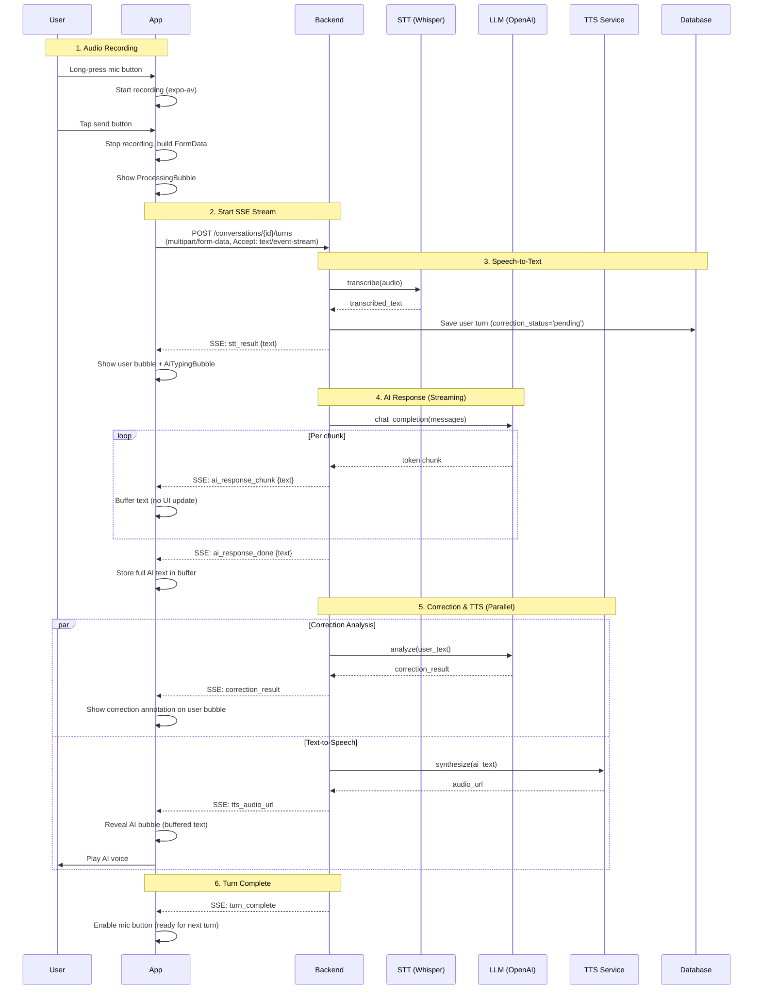

# Talk Screen — Conversation Sequence Diagram

User and AI conversation flow on the Talk screen.

## Overview

1. User records audio via the microphone button
2. Audio is sent to the backend as multipart/form-data
3. Backend processes STT → LLM → Correction + TTS in a single SSE stream
4. Frontend renders messages progressively as events arrive

## Sequence Diagram

## Key Behaviors

| Behavior | Detail |
|----------|--------|
| **AI text reveal timing** | Text is buffered during `ai_response_chunk`/`ai_response_done`. The AI bubble appears only when `tts_audio_url` arrives, so the user sees the text and hears the audio simultaneously. |
| **Correction & TTS parallelism** | The backend runs correction analysis and TTS synthesis concurrently after the LLM response completes. Each sends its event independently. |
| **Fallback on missing TTS** | If `tts_audio_url` never arrives and `turn_complete` fires, the buffered AI text is displayed without audio. |
| **Correction status lifecycle** | `pending` (while analyzing) → `has_corrections` (issues found) or `clean` (no issues). |

## SSE Event Types

| Event | Payload | Frontend Action |
|-------|---------|----------------|
| `stt_result` | `{text}` | Add user turn to store, show user bubble |
| `ai_response_chunk` | `{text}` | Buffer text (no UI update) |
| `ai_response_done` | `{text}` | Store full text in buffer |
| `tts_audio_url` | `{url}` | Reveal AI bubble, start audio playback |
| `correction_result` | `{correctedText, explanation, items}` | Update correction annotation on user bubble |
| `turn_complete` | `{}` | Reset to idle, enable mic button |
| `error` | `{code, message}` | Show error, reset state |

## Related Source Files

### Mobile (Frontend)
- `apps/mobile/src/features/talk/TalkScreen.tsx` — Main screen
- `apps/mobile/src/features/talk/hooks/useTurnStreaming.ts` — SSE event processing
- `apps/mobile/src/api/sse-client.ts` — SSE parser
- `apps/mobile/src/features/talk/hooks/useAudioRecording.ts` — Audio recording/playback
- `apps/mobile/src/features/talk/components/MessageBubble.tsx` — Message rendering
- `apps/mobile/src/features/talk/components/CorrectionCard.tsx` — Correction UI
- `apps/mobile/src/stores/conversation-store.ts` — Zustand state

### Backend (API)
- `apps/api/src/coto/routers/conversations.py` — API endpoints
- `apps/api/src/coto/services/turn_orchestrator.py` — SSE orchestration
- `apps/api/src/coto/services/correction.py` — Correction analysis
